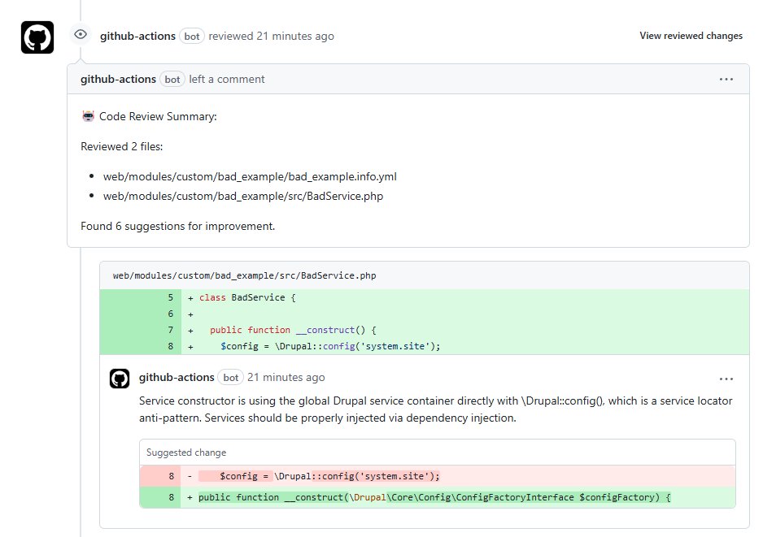
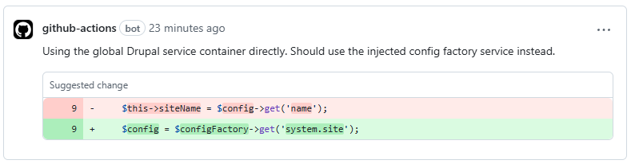

It’s been a while since I’ve posted here. The last few months were packed with projects — shipping features, handling migrations, managing infrastructure, and everything in between. Writing fell by the wayside. But recently, something clicked again.

Dries’ recent post on coding with Claude sparked a familiar feeling: curiosity, a bit of wonder, and the urge to build and share again.
It got me thinking. Not just about AI, but about how much of our work could be smoother — how we can build better systems not only for users, but
for ourselves. That post was a quiet nudge to return to sharing, building in public, and refining the tools we rely on daily.

And it reminded me of something I’ve been tinkering with quietly in my own stack: smarter automation around code review.

> [TL;DR; - Jump to the 'How to' section](#get-it-running)

### One small PR for a Drupal Developer, a giant leap...

In a previous post, I set up GitHub Actions to handle deprecation checks, unit tests, and code sniffing in pull requests, using a lightweight Drupal template repository as the foundation. [Here's a small pull request](https://github.com/balintpekker/drupal-template/pull/5) in that repository — almost insignificant by itself.

But it's not about what the PR changes. It's about **who reviewed it: a bot.**



The comments weren't written by a teammate, or even by me. It was generated automatically by a lightweight review bot I'm experimenting with. And the potential here is exciting!

Code reviews are essential — we all know that. But in practice, they’re often rushed, skipped, or inconsistent. On fast-paced projects, especially in smaller teams, review sometimes becomes a checkbox rather than a true quality gate.

What if we could offload some of the tedious or obvious review steps to an automated system? Not to replace human input, but to augment it — to ensure consistency, catch regressions, and raise the floor on quality.

### What could an AI Drupal Review Bot Do?

We’ve had bots helping with code reviews for a while now — things like `phpcs`, `phpstan`, `drupal-check`, and similar tools integrated into CI pipelines. They’re great at catching the obvious: coding standard violations, deprecated function calls, missing docblocks, or unsafe patterns. But they’re static. They follow strict rules and can’t think beyond what they’re explicitly told to look for. 

AI-powered bots like Claude, on the other hand, introduce a new layer — one that can reason about code structure, spot logic issues, suggest architectural improvements, or even ask thoughtful questions about intent. It’s not just validation; it’s interpretation.



Here are a few **examples** Claude can do that static tools can’t:

* Suggest architectural improvements, like replacing procedural code with service-based approaches.
* Flag readability or complexity issues, offering suggestions to simplify long methods or nested conditions.
* Ask reviewer-style questions, like “What happens if the user doesn’t have access here?” — something only a human (or an AI trained to think like one) would notice.
* Static tools don’t care if your variable name says “profile” but it’s actually storing a company ID. Claude can call that out based on code semantics.
* While static tools can validate syntax in `services.yml`, they won’t understand why a tag might be missing or unnecessary. Claude can interpret intent and suggest better alternatives.

... and I'm sure there are many more.

### Get It Running

The foundation for this experiment comes from the excellent [ai-reviewer](https://github.com/TurboKach/ai-reviewer) GitHub Action by TurboKach. Out of the box, it’s designed to run Claude reviews on pull requests, analyzing the diff and leaving contextual comments as if a human reviewer had stepped in. It supports Anthropic’s Claude models (among others) and is remarkably easy to drop into a CI pipeline.

#### What you'll need

1. You’ll need an Anthropic API key to use Claude, and once you have it, you can store it securely in your repo settings as a GitHub secret, usually under `ANTHROPIC_API_KEY`.

2. A [python script](https://github.com/balintpekker/drupal-template/blob/main/.github/scripts/pr_review.py) that does the job for us.
3. The [GitHub workflow file](https://github.com/balintpekker/drupal-template/blob/main/.github/workflows/code_review.yml
   ): `.github/workflows/pr-review.yml` with the following content:
    ```yaml
    name: AI PR Review (Claude with Inline Comments)
    
    on:
      pull_request:
        types: [opened, synchronize, reopened]
        branches: [main]
    
    permissions:
      contents: read
      pull-requests: write
    
    jobs:
      ai_review:
        runs-on: ubuntu-latest
    
        steps:
          - name: Checkout PR code
            uses: actions/checkout@v4
    
          - name: Set up Python
            uses: actions/setup-python@v4
            with:
              python-version: '3.11'
    
          - name: Install dependencies
            run: pip install anthropic PyGithub
    
          - name: Run Claude AI Reviewer
            env:
              GITHUB_TOKEN: ${{ secrets.GITHUB_TOKEN }}
              ANTHROPIC_API_KEY: ${{ secrets.ANTHROPIC_API_KEY }}
              # Customize file filtering here
              PR_REVIEW_WHITELIST: '**/*.php,**/*.module,**/*.install,**/*.theme,**/*.twig,**/*.yml,**/*.yaml'
              PR_REVIEW_BLACKLIST: '**/vendor/**,**/core/**,**/contrib/**,**/node_modules/**,**/dist/**,**/bin/**,**/web/libraries/**,**/sites/default/files/**'
              PR_REVIEW_MODEL: claude-3-5-haiku-20240307  # or 20241022 if you prefer
              PR_REVIEW_MAX_TOKENS: '3000'
            run: python .github/scripts/pr_review.py
    
    ```


To make it more Drupal-aware, I made a few changes:
* Tweaked the file ignore patterns (`PR_REVIEW_BLACKLIST`) to skip core and contrib files amongst others while still catching custom module logic and YAML configurations.
* Limited review scope (`PR_REVIEW_BLACKLIST`) to the most relevant file types for Drupal custom development.

At the heart of the script lies a deceptively simple but powerful concept: prompt engineering. This is where Claude gets its instructions on **how to review the code and what to look for,** how to phrase the feedback, and what kind of tone to use.

The current prompt looks like this:
```
You are a senior Drupal developer performing a code review on a pull request.

Your task:
- Identify code issues, potential bugs, and improvements.
- Follow official Drupal coding standards: https://www.drupal.org/docs/develop/standards
- Be constructive and helpful. Focus on critical or architecturally important improvements.
- Do not flag minor style issues unless they impact readability or maintainability.
- Respond in clear, actionable language.

Pay special attention to:
- Proper use of Drupal APIs (e.g., Entity API, Form API, Routing, Render Arrays)
- Service usage: Use dependency injection where possible, avoid using \Drupal::service() directly unless within procedural code.
- Security best practices: Never concatenate SQL directly; use the database API or entity queries.
- YAML files: Validate config/schema format. Ensure permissions and routing definitions are properly declared.
- Twig templates: Sanitize output using `|escape`, use `t()` for strings where necessary.
- Naming conventions: Ensure classes, functions, services, and hooks are named consistently with Drupal standards.
- Avoid hardcoded strings or IDs. Use constants or configuration.
- Do not repeat logic that already exists in Drupal core/contrib.
- Ensure PHPDoc and inline comments are useful and up to date.

[...]
```

The full prompt can be found [here](https://github.com/balintpekker/drupal-template/blob/main/.github/scripts/pr_review.py#L165).

### How much is the fish?

Claude charges per token, and token usage depends on the size of the files and the review context. For reference:
* Reviewing a single small PHP file (~ 150 lines) typically costs **$0.01–$0.03** depending on the model used.
* A full PR with multiple files might run up to **$0.10–$0.25**.

However, you can configure the action to limit token usage or model scope, which is especially helpful if you want to run it only on larger PRs or in specific repos. That means you can feasibly add AI review to your dev workflow without breaking the budget — especially when compared to the value of catching a subtle bug before it ships.

### Thoughts

While this is still early experimentation (at least for me), it's already clear that AI-assisted code review can bring real value — especially in fast-paced projects where every bit of automation helps. I'm not saying tools like Claude can replace human reviewers, but they do raise the quality by catching small things, asking smart questions, and giving us developers more time to focus on the parts that truly require human insight. 