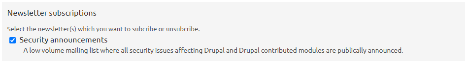
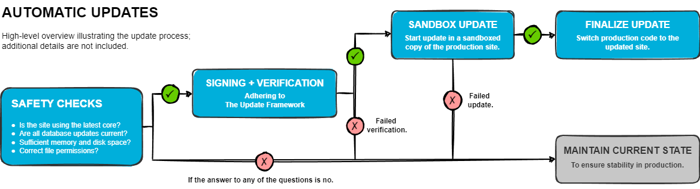
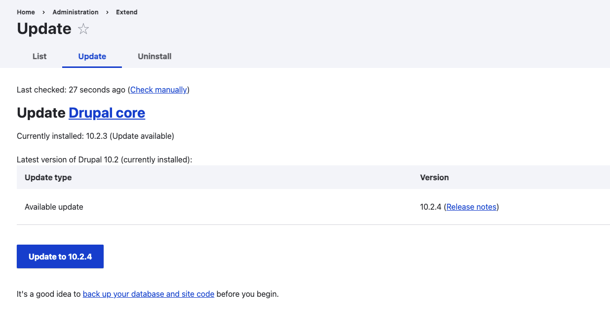
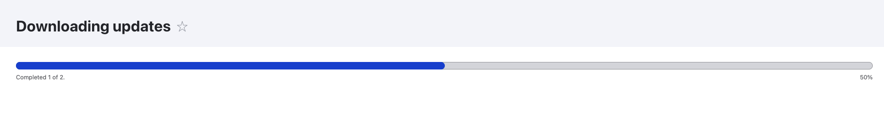
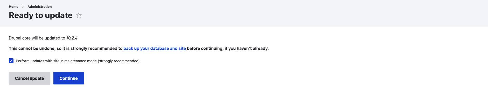
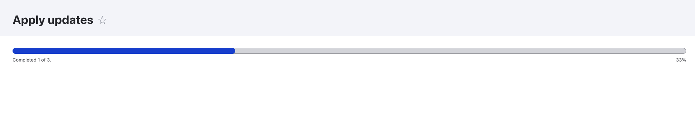
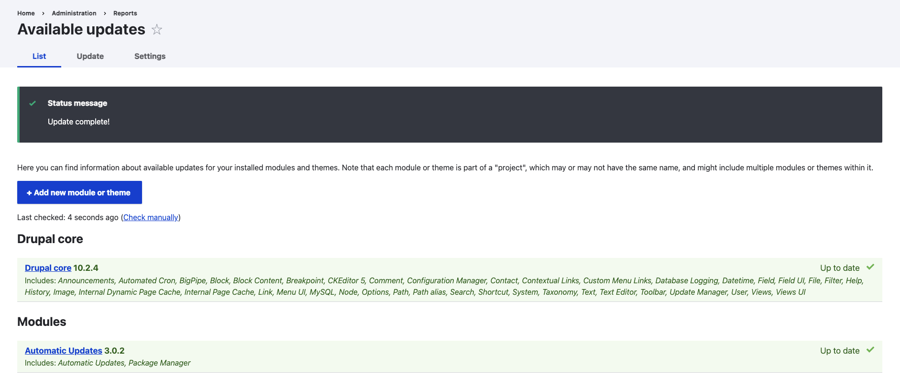

The Automatic Updates initiative will not only address the often painful
process of manually installing crucial security updates but will also make it
significantly easier for your Drupal site to remain up-to-date with the security
advisories and the latest protections against potential threats. Let's dive into
the details and see how it works.

Updating a Drupal site manually has long been recognized as both challenging and
expensive, remaining a top concern for Drupal users over the years. The objective
of the initiative is to eliminate this concern by offering a solution for
maintaining Drupal sites securely, hopefully enhancing Drupal's overall reputation
among users all over the world.

> [TL;DR; - Jump to the 'How it works' section](#how-it-works)

### Security

Before moving forward, it is important to understand the
importance of security. With cyber threats becoming increasingly
diverse, website owners must be proactive in safeguarding their digital assets.
Vulnerable websites are not only exposed to data breaches and hacking attempts but
also risk damaging their reputation and losing the trust of users.

Drupal has an awesome [security team](https://www.drupal.org/drupal-security-team)
coordinating security announcements in release cycles evaluating whether the issues
are ready for release several days in advance. They typically send out emails
regarding advisories every Wednesday, and you can always find
updates on the [#security-team](https://drupal.slack.com/archives/C5B7P7294) channel
on Drupal Slack.

You have the option to subscribe to the announcements in your Drupal.org
profile, ensuring you receive these emails whenever there is an advisory.



__Automatic updates provide you with the choice to seamlessly integrate these
security fixes into your site, eliminating the delay before these updates
are applied.__ This enhancement boosts security by reducing the window for
potential attackers to exploit released advisories.

> A noteworthy mention here is [Drupal Steward](https://www.drupal.org/drupal-security-team/steward),
> a paid service from the Drupal Association and the security team providing a
> globally distributed [WAF](https://en.wikipedia.org/wiki/Web_application_firewall)
> which can protect Drupal sites from certain types of highly-critical
> vulnerabilities.

### Advantages

The primary advantage of the initiative lies in its ability to __enhance security__,
as outlined above. The proactive approach effectively safeguards sensitive data and
preserves the integrity of Drupal websites.

Furthermore, it brings significant __time and resource savings__ to the table. The
process of manual updates can be time- and resource-intensive, particularly for
agencies managing multiple Drupal installations. With Automatic Updates, maintainers can utilize their
time and resources more efficiently, directing their focus towards other
aspects of website management and optimization.

Ultimately, for website owners and stakeholders, __peace of mind__ is invaluable.
The consistent protection against evolving security threats allows them to prioritize
delivering exceptional digital experiences without concerns of potential breaches.

The fourth advantage will be explored further in this article, related to
another initiative.

### Requirements and Limitations

The [contrib module](https://www.drupal.org/project/automatic_updates)
requires  a Drupal site managed via Composer, with a Composer version of 2.6 or higher.

Currently, to enable the module's functionality through the browser, Drupal
must have the capability to modify its own codebase. However, this action
is often deemed a security risk by many hosting providers, rendering the module
incompatible with the majority of Acquia and Pantheon solutions. Fortunately, there
are a couple of options for this scenario until Drupal-specific hosting providers
make the necessary changes:
* You can use the module in a local environment, with subsequent changes pushed
  to the hosting environment. _(This approach contradicts the time-saving advantage,
  and is therefore not recommended.)_
* Alternatively, the 3.x version of the module has a Symfony script that
  allows updates even when the webserver lacks the ability to modify the codebase.
  To ensure regular updates, a privileged user can invoke the following script using
  a unix style crontab: 
  ```cli
  php /path/to/module/automatic_updates/auto-update
  ```

Another current limitation of the module is its inability to utilize Drupal's
cron for automatic updates until Drupal.org implements support for
[The Update Framework](https://theupdateframework.io/).
Efforts are underway within the [PHP-TUF library](https://github.com/php-tuf/php-tuf)
to address this issue, ensuring the proper signing of security updates.
Furthermore, plans include [integrating the library with Composer](https://github.com/php-tuf/composer-integration),
dependent on Drupal.org's packaging pipeline and Composer facade supporting
PHP-TUF signing.

Some other limitations include the inability of the initiative to be utilized
in a multisite environment, as well as its incapacity to revert a completed update
or roll back to a previous version if an update has already been executed.
Additionally, it does not support updating major versions, which
must still be done manually (with the assistance of
[Upgrade Status](https://www.drupal.org/project/upgrade_status) and/or
[Drupal Rector](https://github.com/palantirnet/drupal-rector)).

#### The Bright Side

The good news is that minor version upgrades are supported. However, to enable
this feature, you'll need to set the `allow_core_minor_updates` key to `true` in
the `automatic_updates.settings` config object, as it is disabled by default.

Also, the module comes with a submodule called Automatic Updates Extensions
which is currently in an experimental state designated to handle contrib project
updates.

### How it works

The process involves applying patch-level updates to Drupal core within a
sandboxed copy of your site. This ensures that if anything goes wrong, your
main site remains unaffected. If everything proceeds smoothly, the updates are
deployed (switching the sites) using either native PHP or rsync.



1. First, to ensure the safety of an update before execution, the following
   checks will be applied through validation listeners:
    * Is the site utilizing the latest core release and does it align with the
      official version?
    * Are there any pending database updates for the site?
    * Is there sufficient disk space and memory available for the update?
    * Are file permissions properly configured?

2. Following that, a signing and verification step takes place, adhering to the
   [TUF](https://theupdateframework.io/) specification. Signed versions will be provided by Drupal.org and the security
   team, while the [PHP-TUF](https://github.com/php-tuf/php-tuf) library integrated into Composer will verify the packages
   before installation, ensuring security.

3. Once the checks are completed and everything appears to be in order, the update
   takes place within a sandboxed version of your site.
4. If the update is
   successful, the production site should seamlessly transition to the new
   codebase. However, if any issues arise, the system maintains the current state,
   ensuring that the production site remains unaffected.

#### Package Manager API

The Package Manager, responsible for the stage directory (the sandbox copy of
the production site without site specific assets) features an event-based API
enabling you to monitor changes throughout the update process.

> The lifecycle of the stage directory consists of four stages: create, require,
> apply, and destroy. You can find more details about the lifecycle
> [here](https://git.drupalcode.org/project/automatic_updates/-/raw/8.x-2.x/package_manager/package_manager.api.php).

Events are dispatched before and after each operation in the stage lifecycle.
There are two types of events: pre-operation and post-operation:
* Pre-operation event subscribers can analyze the state of the stage directory
  or the system at large and flag errors if any problems are detected.
* Post-operation events are simple triggers that allow custom code to react
  when an operation is complete.

Imagine a platform that aggregates different Drupal sites and displays their
current update statuses, allowing you to manage each site from a single interface.

#### Project Browser

Did you catch that fourth advantage we mentioned earlier? [Project Browser](https://www.drupal.org/project/project_browser),
another awesome initiative that enables the installation of modules, [recipes](https://bpekker.dev/drupal-recipes/),
themes, and more, utilizes Automatic Updates. The synergy between these
initiatives will simplify both updating and extending Drupal, which will likely
appeal to more users, thereby enhancing Drupal's user base. Once these features
are integrated into the core, individuals can turn to Drupal-specific
hosting providers to create professional websites without any coding required.

#### How to start

You can incorporate the contrib project into any Drupal version 10.1 or higher using:
```cli
composer require "drupal/automatic_updates:^3"
```

Keep in mind that you may encounter errors if your minimum stability in your composer.json is set to stable.

Once you've installed the module (along with the package manager), you can adjust the module settings in `admin/reports/updates/settings`. This includes:

* Setting the update interval (Daily/Weekly)
* Specifying whether to check for updates for uninstalled modules/themes
* Choosing to send emails to recipients when updates are available
* Enabling automation of the update process through unattended mode and cron, or the Symfony script, with options to:
   * Apply security patches only
   * Apply all patch releases

If everything is set up, you can navigate to the Update page (`admin/modules/update`). The first step involves a safety check — as described above — and if there is a problem, you'll receive a warning message with proper instructions on how to continue, otherwise you'll be able to see the list of updates for your installed packages:

> It's always a good idea to [back up your database and site code](https://www.drupal.org/node/22281) before you begin.



After clicking the update button, the update download process begins using a batch process:



Following the download process, you can choose whether to apply the downloaded update.



Clicking "Continue" here will initiate the upgrade process within the sandboxed version.



If everything went smoothly, you should now have an updated version of your site.



### Thoughts

The overall outlook on the initiative is undeniably positive, as evidenced by its
impressive scope. I am truly inspired by the remarkable dedication of the team
driving this initiative forward, tirelessly working to overcome obstacles and
elevate it from an initiative to an experimental phase, and eventually
to a core module.

My hope is that Drupal-specific hosting providers will address the limitations
described earlier. This way, once the initiative becomes part of the core,
we'll have a solution that is truly limitless.

For more information or if you're simply interested, feel free to join the
discussion in the [#autoupdates](https://drupal.slack.com/archives/C7QJNEY3E) channel.
