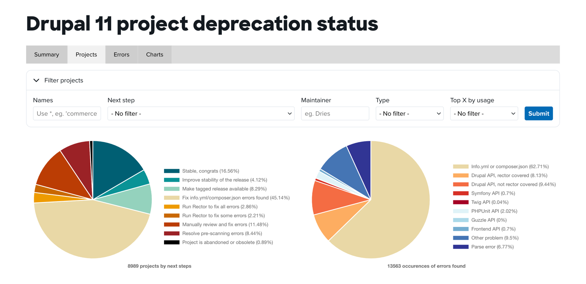
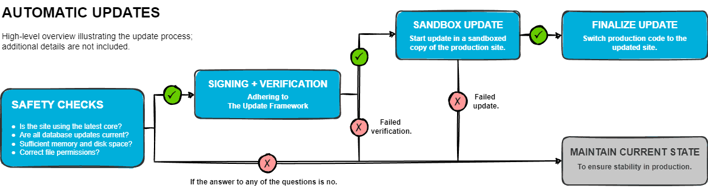
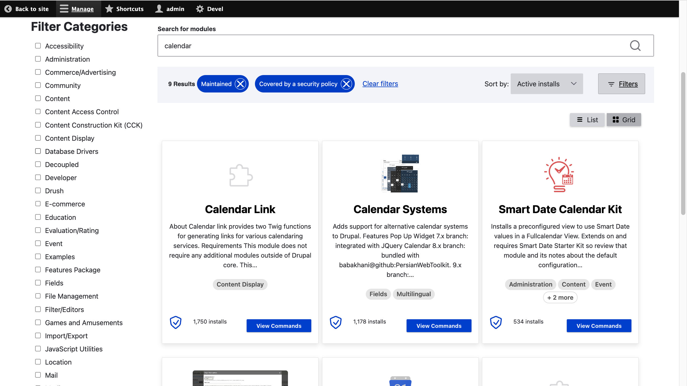
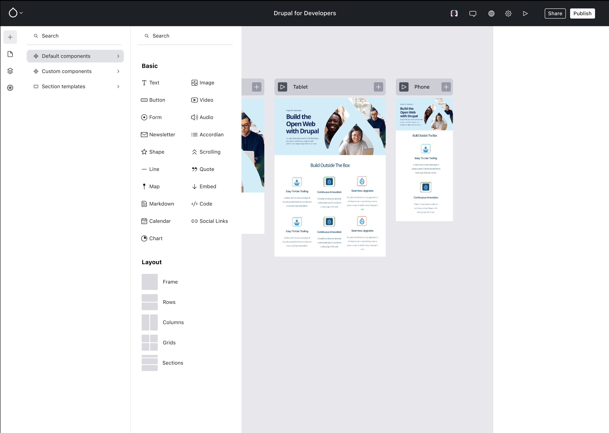
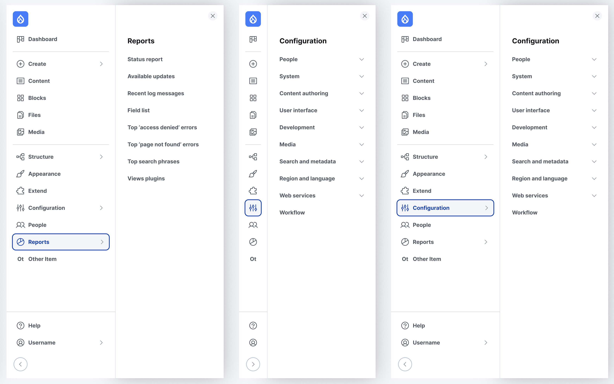

The release of Drupal 11 is on the horizon, yet comprehensive information on its features,
deprecated modules, and system requirements is scattered. While you can piece together
details from documentation and community forums, it would be much more convenient to have
everything in one place, hence this post. Since the release of Drupal 10.2, we've known
about the deprecations and experimental modules, allowing us to prepare for the transition.
With Drupal 10 receiving long-term support (LTS) until Drupal 12, possibly arriving in
mid-late 2026, there's no immediate rush to upgrade. However, the benefits of the new
features in Drupal 11 make the upgrade highly worthwhile.

> [TL;DR; - Jump to 'The new stuff' section](#the-new-stuff)

### When's the Big Day?

Based on the [core release cycle schedule](https://www.drupal.org/about/core/policies/core-release-cycles/schedule),
__Drupal 11 is expected to be released on the week of July 29, 2024, which is this week!__ It's worth noting the
current status of contributed modules as this date draws near. Based on [the Drupal
Association's report](https://dev.acquia.com/drupal11/deprecation_status/projects?_gl=1*1hid6o0*_up*MQ..*_ga*NjA2OTQ3NDg1LjE3MjEzMDQwNzc.*_ga_V13QDCV2T9*MTcyMTMwNDA3Ny4xLjAuMTcyMTMwNDA3Ny4wLjAuMA),
currently only about 17% of contributed modules are stable and ready for Drupal 11, with
around 40% of the top 100 modules being compatible.

> You can always contribute to Drupal. If you're a maintainer, check for open and reviewed
> Drupal 11 related issues and create new releases as needed. Experienced contributors
> can come in handy by addressing other things that have been left — please look
> through all issue queues, and search for Drupal 11 related posts. If you're new, you can
> get involved by helping with testing, and if you're feeling bold, you can also submit
> changes directly. Regardless of your experience level, all contributions are valued and
> appreciated.

### System requirements

##### Webserver

The webserver requirements will remain unchanged, but there is an [RFC](https://www.drupal.org/about/core/blog/rfc-remove-support-for-windows-in-production-in-drupal-11)
to remove support for Windows in production. The decision is primarily due to the challenges
of providing automated testing for IIS and WAMP, coupled with the significant decrease in
the usage of IIS and Windows servers over the years.

This means, the supported web servers are:
* __Apache 2.4.7 or higher__
* __Nginx 1.1 or higher__
* Any other web server with proper PHP support

##### PHP

Many do not know, but since Drupal 9.4 a [policy](https://www.drupal.org/node/3261451) was
adopted to automatically drop support for PHP versions not supported anymore by the PHP
maintainers (by deprecating `\Drupal::MINIMUM_SUPPORTED_PHP` and replacing it with
`\Drupal\Core\PhpRequirements::minimumSupportedPhp()`), which means Drupal will not support
older versions along the way.

Therefore, __Drupal 11 will require PHP 8.3__

##### Database

* MySQL / Percona 8.0
* MariaDB 10.6
* PostgreSQL 16
* SQLite 3.45

##### Dependencies

* Symfony 7
* PHPUnit 10
* jQuery 4

##### Composer

__Drupal 11 will require Composer 2.7.0 or newer__. The reason behind this is the security
advisory of the composer package from February 2024. [(CVE-2024-24821)](https://github.com/advisories/GHSA-7c6p-848j-wh5h)

##### Browsers

The list of supported browsers have not changed, as Drupal already drops support for older browser
versions as new ones get released. Usually for the most common browsers (Google Chrome, Firefox, Safari, Opera, Microsoft Edge)
__the latest 2 major versions are supported__. The full list can be found [here](https://www.drupal.org/docs/getting-started/system-requirements/browser-requirements#s-supported-browsers-).

### The new stuff

Back in 2022, Dries said the goal for Drupal is to be established as the preferred tool,
the go-to solution for ambitious site builders. Since then, we could say there are three
primary goals, or key areas for the upcoming release:
- Improve on the site-building tools
- Improve the content editing experience
- Simplify the upgrade process

But what are the actual tools, the new stuff that solidifies the above? More or less Drupal 11
is the same as Drupal 10.3, but without the deprecated features and with updated system
requirements. As a result, you might find familiar items in this list, or some features
that are already available in Drupal 10.3.

_Please note that the following information has been gathered from various sources and may not be confirmed or accurate. Please handle this information accordingly._

##### Automatic Updates

The Automatic Updates initiative will not only address the often painful process of manually
installing crucial security updates but will also make it significantly easier for
your Drupal site to remain up-to-date with the security advisories and the latest
protections against potential threats.

More on the functionality can be found [here](https://bpekker.dev/automatic-updates/).

##### Project Browser

Project Browser offers an integrated interface withing the Drupal admin dashboard, allowing
users to easily browse and install modules with a single click. This eliminates the need to
leave the Drupal site for module discovery or to use command-line tools like Composer for
installation.

Additionally, it enhances the user experience by guiding users through the process. It provides
filters and search options, making it easy to find the best modules for the actual need.

##### Recipes

Introduced in: Drupal 10.3 (Experimental) ([CR](https://www.drupal.org/node/3445169))

Recipes is a versatile tool providing steps for site builders and developers to enhance the
functionality of a Drupal site at any given point, whether it's a brand-new project or an
already existing application.

There is already a [Recipes Cookbook](https://www.drupal.org/docs/extending-drupal/contributed-modules/contributed-module-documentation/distributions-and-recipes-initiative/recipes-cookbook)
on Drupal.org, which will expand significantly once Drupal 11 and Project Browser are
released. This resource aims to provide a wealth of pre-defined configurations that will
be useful for everyone, from content editors and site builders to developers.

More on the functionality can be found [here](https://bpekker.dev/drupal-recipes/).

##### Experience Builder

Introduced in: Drupal 11 (possibly as experimental)

The new Experience Builder will make it easier for site builders to directly theme and build
their sites within the browser, without any coding. This tool will let large design change -
like rebranding - to happen without a developer being involved, which reduces costs. Moreover,
this functionality will lower the entry barrier, something that may make Drupal more attractive
to some other well-known CMSs.

The Figma of the high-level wireframe can be found [here](https://www.figma.com/design/RDBTpKh82Ku4WHGaKuE6WR/Next-Gen-Page-Building-Wireframes?node-id=0-1)
Also, the initial implementation of the top bar has landed: [https://www.drupal.org/project/experience_builder/issues/3458863](https://www.drupal.org/project/experience_builder/issues/3458863)

##### Single Directory Components (SDC)

Single Directory Components (SDC) is a new standardized structure for organizing frontend
components, making them more reusable and easily maintainable. With everything needed
for a component housed in the same directory, this approach reduces errors when making
changes, upgrading, or deleting component-related files. The main advantage for developers
is the enhanced reusability, leading to a more efficient site-building process. Once
these components become available through the Project Browser, When used in conjunction with
the Experience Builder and Recipes, the possibilities will be limitless.

More on the Recipes can be found [here](https://bpekker.dev/single-directory-components/).

##### New Navigation

Introduced in: Drupal 10.3 ([CR](https://www.drupal.org/node/3443691))

The primary purpose of the new navigation is to allow site builders to customize their
administration interface through the UI. It enables them to reorganize, add, or remove
blocks of links within the administration menu.

More info can be found in the core module, or [on the project page](https://www.drupal.org/project/navigation)

---

#### Notable mentions:

##### Access Policy API

Introduced in: Drupal 10.3 ([CR](https://www.drupal.org/node/3385551))

Access Policies are tagged services that automatically adjust user permissions based on
globally available contexts. This means you don't need to manually intervene for custom
logic to execute. For example, you can set up a policy that allows content editors to
post content only on workdays, a task that would be challenging with the current
role/permission system. This enhancement unlocks endless possibilities for modifying
your site's behavior.

More on how the API works can be found [here](
https://bpekker.dev/access-policy-api/#how-does-it-work).

##### Announcements Feed

Introduced in: Drupal 10.2 ([CR]((https://www.drupal.org/node/3399817)))

The purpose of this module is to offer Drupal site owners a channel to receive content
relevant to their interests. This content is gathered from the following feed: [https://www.drupal.org/about/announcements](https://www.drupal.org/about/announcements)

More on the module overview can be found [here](https://www.drupal.org/docs/core-modules-and-themes/core-modules/announcements-feed/announcements-feed-module-overview).

##### Workspaces

Introduced in: Drupal 8.6 ([CR](https://www.drupal.org/node/2968491))

Workspaces provide a _new_ way to manage content on your Drupal site, allowing you to
create parallel copies of your live site and designate a workspace as a parent of another.
For instance, you can set staging as the parent workspace for other workspaces used by
your content creators. With proper permissions, a content moderator can oversee all changes.
This feature enables content creators to alter the layout in various ways.

Additionally, there's a contributed module called [Workspaces Extra](https://www.drupal.org/project/wse)
(under active development) that enhances this functionality by allowing you to:
- Alter the site configuration
- Provide group access to different workspaces
- Add extra layout builder functionality
- Enable menu link changes
- Generate preview links for workspaces
- Schedule workspace publishing

### Thoughts

Drupal 11 brings groundbreaking features enhancing usability and efficiency for everyone involved.
However, I think its announcement hasn't generated as much excitement or visibility as
previous versions - possibly because of the Starshot initiative -, leaving many unaware
of these significant improvements. 
