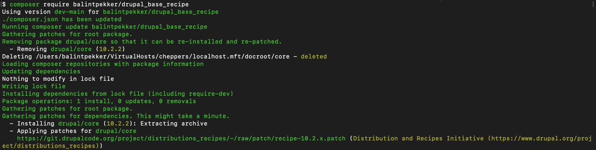
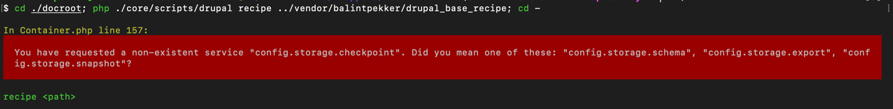
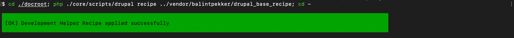
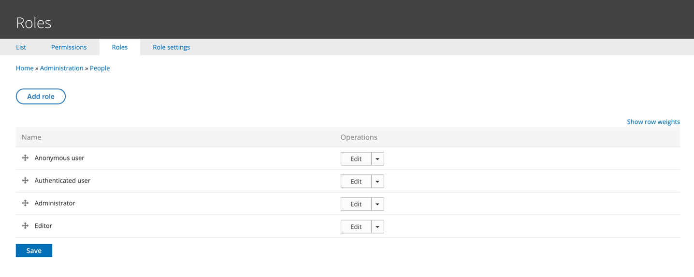

Does the process of configuring modules and setting up content types manually from scratch sound all too familiar? Have you ever wished for a secret ingredient to simplify your Drupal development process? That's exactly what recipes bring to the table: a structured approach to site building that saves you precious hours of trial and error. After all, in the world of development, time equals money.

> [TL;DR; - Jump to the 'How to' section](#how-to-create-and-use-a-recipe)

### What is a Recipe in Drupal?

The initiative's name originates from its role as a versatile tool providing steps for site builders and developers to enhance the functionality of a Drupal site at any given point, whether it's a brand-new project or an already existing application.

These steps involve various tasks, allowing us to create a solution for building applications that share similarities with each other. For example, we can construct a recipe for a news site, which not only creates the necessary content types but also configures meta tags for each post, sets up image styles and potentially generate sample articles.

> _Note: Starting from Drupal 10.3 [all image styles shipped with core include webp conversion](https://www.drupal.org/node/3421405) as the final step._

Furthermore, by leveraging [Single Directory Components](https://bpekker.dev/single-directory-components/), we can take this a step further and manage a robust ecosystem capable of assembling a sample site from contributed modules, configurations and components.

### Differences from Distributions

Recipes are most beneficial for users and companies maintaining and developing similar sites and applications. Typically, there are existing (custom) distributions serving this purpose. So, what sets recipes apart?

Perhaps the most notable distinction lies in the usability of recipes. Unlike distributions, __recipes can be implemented at any stage of a Drupal application's lifecycle__, ensuring ease of use and adaptability. Moreover, recipes offer effortless maintainability, allowing for straightforward updates with minimal effort. On the other hand, maintaining distributions poses challenges, such as synchronizing components and configurations with the latest advancements in core (or contributed modules/themes).

Also, with recipes, you have the flexibility to include only specific configurations for a module or to utilise an installation profile, such as Standard, while excluding certain components like the Page content type. This level of customization makes recipes more versatile compared to distributions, as you can tailor the setup precisely to your project's requirements without being constrained by predefined configurations.

### The current state of the initiative

While the initiative, as outlined in the [roadmap document](https://git.drupalcode.org/project/distributions_recipes/-/blob/1.0.x/docs/recipe_roadmap.md), is in Phase 1, the activity within the issue queue, particularly the reviewed and tested issue of [converting the standard profile into a set of recipes](https://www.drupal.org/project/distributions_recipes/issues/3417835) targeting Drupal 11, reinforces the significance and commitment of this functionality.

Currently, in the issue above a new install profile called 'Empty' is created, to have a _minimal_ profile to start with. Once you are able to use it, you can apply any of the recipes in `core/recipes`. __This issue is not necessary to use Recipes.__

### How to create and use a Recipe?

#### Prerequisites

As the initiative currently stands, we must prepare Drupal to accommodate Recipes by applying a patch. We will not cover how to set up the [Composer Installers Extender](https://github.com/oomphinc/composer-installers-extender) plugin, or how to use [Composer Patches](https://github.com/cweagans/composer-patches), as there are instructions for that in several places on the web, also you can manually apply a patch without the need of these.

Currently, [there are patches available for Drupal 10.0.x and higher](https://git.drupalcode.org/project/distributions_recipes/-/tree/patch). To apply the patch to your Drupal 10.2 site, you can run:

```cli
curl https://git.drupalcode.org/project/distributions_recipes/-/raw/patch/recipe-10.2.x.patch | git apply
```

Alternatively, you can incorporate one of the patches from the provided link above directly into your `composer.json` file _(if you are using the composer patches plugin)_.

```
"patches": {
    "drupal/core": {
      "Distribution and Recipes Initiative (https://www.drupal.org/project/distributions_recipes)": "https://git.drupalcode.org/project/distributions_recipes/-/raw/patch/recipe-10.2.x.patch"
    }
},
```

Should you intend to include custom packages in your recipes, it is advised to utilize the [Drupal Recipe Unpack](https://gitlab.ewdev.ca/yonas.legesse/drupal-recipe-unpack) plugin. This plugin is responsible for the copying of the recipe's packages directly into your project's `composer.json` file.

#### How to create a recipe

Now that we've completed the prerequisites, let's dive into the real work. To start, I recommend setting up a custom repository for your recipes. This ensures they can be efficiently managed, versioned, and utilized across various projects.

A Recipe at minimal consists of a `recipe.yml` file, which can include three different things:

##### Installable modules listed under the `install` key

You have the option to specify an array of modules and/or themes for installation, provided they are not already enabled. Drupal will automatically detect whether each item is a module or a theme and proceed to generate simple configurations for them within the system. This simplifies the process of installing and configuring additional modules or themes as needed:

```yaml
install:
  - admin_toolbar
  - allowed_formats
  - big_pipe
  - block
  # ...
```

##### Configuration-related tasks detailed under the `config` section

You have the flexibility to interact with configurations in two ways within a recipe:
* You can import all configurations for a module by using an asterisk (`*`) which tells your system to include every base configuration along with the optional ones
* Or import a subset of configurations by specifying a list to import only specific configurations for a module.

```yaml
config:
  import:
    media: '*'
    node:
      - views.view.content
```

When you need to modify the active configuration on an existing site, not just importing new ones, you can leverage the `simple_config_update` action. For example, you can update the site's default theme with:

```yaml
config:
  actions:
    system.theme:
      simple_config_update:
        default: 'claro'
```

Or you can create roles (ensure they exist) with granting permissions:

```yaml
config:
  actions:
    user.role.editor:
      ensure_exists:
        label: 'Editor'
      grantPermissions:
        - 'create article content'
        - 'delete any article content'
        - 'edit any article content'
```

The process described above would be ineffective if the configuration for the user role were not present in the `config` folder of your recipe. This folder is the place where you can include configurations to be integrated into your application when you apply the recipe.

A full list of config actions, and a comprehensive guide can be found at the initiative's [documentation](https://git.drupalcode.org/project/distributions_recipes/-/blob/1.0.x/docs/config_actions.md).

##### Content-related tasks specified under the `content` section

As of now, the documentation includes this feature under the implementation tasks section, indicating that it is still in the process of being fully developed and discussed. My assumption (or suggestion) is that the content should be organized as YAML files under entity type named folders, such as `content/page/node.page.[uuid].yml`. However, until the precise process is defined, [Default Content](https://www.drupal.org/project/default_content) can serve as a viable alternative for achieving similar functionality.


> The full recipe can be found at https://github.com/balintpekker/drupal_base_recipe

##### Creating a "Drupal Cookbook"

Recipes allow you to define other recipes to be included by defining them under the `recipes` key:

```yaml
recipes:
  - recipe_1
  - recipe_2
```

The concept of creating a "Drupal Cookbook", a collection of recipes holds potential to ease the lives of various communities, whether it's the global Drupal community, your local group of developers, or your own company. Additionally, utilizing recipes within other recipes opens up a world of creative potential.

#### Applying a recipe

If you've decided to follow the advice and attempt to apply a recipe from a repository, your initial step is to incorporate it into the repository section of your `composer.json` file within your project. For example:

```
{
 "type": "vcs",
 "url": "https://gitlab.com/balintpekker/drupal_base_recipe"
}

```

Then you can use composer to require the package as usual: 

```
composer require balintpekker/drupal_base_recipe
```



> If you are using custom packages in the recipe you plan to apply, it's advised to first unpack the package requirements to the site's composer.json with the following command:
>
> ```cli
>  composer unpack [organization/package-name]
>  ```

Until reaching Phase 2 and a user interface (UI) for easier application, recipes are currently applied using Drupal core's PHP script. You can execute the following command in the CLI from your drupal root (whether it's located in the `web`, `docroot` or any other folder, once you changed into that directory):

```cli
php core/scripts/drupal recipe recipes/contrib/[recipe-name]
```

> Note: You could have an issue of not having the `config.storage.checkpoint` service ready in your Drupal installation. This service is added via the patch file, so you'll need to clear caches to address this issue.
> 
> 
> 
> Once the cache is rebuilt, the recipe applies successfully:
> 
> 

__After applying the recipe__, it's also necessary to __clear the caches__ to ensure the changes take effect.

The recipe above installs some modules and creates the Editor role with edit/delete article permissions:



Once you've confirmed that everything is as desired, you can proceed to commit the changes to your project.

#### Conflicts

When you encounter a situation where a recipe requires a different version of a package than the one already utilized in your Drupal website (such as config ignore's version 2 and 3), you have a couple of options:

* Update your project to match the package requirements from the recipe
* Update the recipe to match your project's requirements:
  * Manually in the recipe if it's a custom repository hosted by you
  * Leverage composer patches and patch the recipe to adjust it, ensuring that it aligns with your project's dependencies


### Thoughts

In my opinion, recipes have the potential to greatly simplify the daily routines of individuals who find themselves repeatedly performing similar tasks on Drupal sites. I'm optimistic that the initiative to integrate recipes into Drupal.org will inspire contributions from the community, providing configurations for various tasks in the future. Additionally, I believe the inclusion of recipes in the [Project Browser](https://www.drupal.org/project/project_browser) (another initiative) would be a great enhancement too. If you are interested, take a look at the [#distributions-and-recipes](https://drupal.slack.com/archives/C2THUBAVA) channel on Drupal Slack, or read the [documentation](https://git.drupalcode.org/project/distributions_recipes/-/blob/1.0.x/docs/recipe.md).
