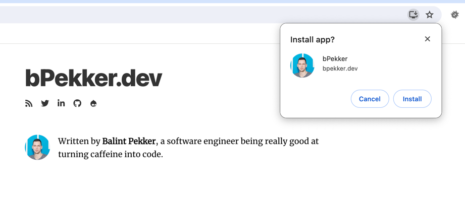

In the world of Drupal, staying ahead of the curve is essential for building websites that are not just functional but also future-proof. As the digital landscape continues to evolve, it's crucial to explore emerging trends and technologies in Drupal development that are shaping the future. In this blog post, we'll dive into some of these exciting possibilities and discuss how they can lift Drupal websites to new heights.

### Decoupled Architectures: Embracing Flexibility and Scalability

Decoupled architectures, also known as headless Drupal, have recently gained significant attention in the Drupal community. This approach involves separating the frontend presentation layer from the backend content management system, allowing for greater flexibility and scalability. With decoupled Drupal, developers can leverage modern JavaScript frameworks like React, Vue.js, or Angular to create dynamic user experiences while still benefiting from Drupal's robust content management capabilities.

#### Benefits

One of the key benefits is the __improved performance__. By offloading the frontend rendering to client-side JavaScript frameworks, decoupled Drupal can achieve faster page load times and smoother user experiences. This results in increased happiness and engagement among visitors.

Another advantage of decoupled Drupal is its __cross-platform support__. With the frontend and backend decoupled, content can be easily consumed across various devices and platforms, including desktops, tablets, mobile devices, and more. This ensures a consistent and seamless experience for users, regardless of their preferred device or browsing environment.

#### Examples:

* A headless solution using __Drupal CMS with a [Gatsby](https://www.gatsbyjs.com/) frontend__ offers great speed and flexibility.
* __Drupal CMS paired with [Nuxt.js](https://nuxt.com/) frontend__, a Vue.js-based framework for building server-rendered and statically generated websites can yield a fast and interactive frontend experience.

### AI and Machine Learning Integration: Revolutionizing User Experiences

Artificial intelligence (AI) and machine learning are revolutionizing the way websites are built and personalized. In Drupal development, AI-powered tools and technologies are being integrated to automate tasks, enhance user experiences, and drive business insights.

While Drupal does not have native AI integration (yet), there is a rising demand from clients for automated features such as automatically tagging content and generating node titles. Contributed modules like [Automatic Entity Label](https://www.drupal.org/project/auto_entitylabel) provide automation for generating automatic entity labels, although they are not AI-powered at the moment.

AI-driven chatbots and personalized content recommendations are also becoming increasingly popular in the Drupal ecosystem. These features leverage machine learning algorithms to analyze user behaviors and preferences, delivering tailored experiences that boost engagement and satisfaction.

### Progressive Web Applications: Bridging the Gap Between Web and Mobile

Progressive web applications (PWAs) represent the convergence of web and mobile technologies, offering users app-like experiences directly through their web browsers. While PWAs have been around for a while, their adoption continues to grow as developers seek to provide seamless experiences across devices and platforms.

#### Benefits

PWAs offer several benefits, including __fast load times, offline access, and push notifications__. These features enable PWAs to deliver a seamless user experience regardless of the device or network conditions. Additionally, PWAs can boost search engine optimization and improve the overall performance of Drupal websites.

> Did you know? You can install this site as a PWA by clicking the download icon in your browser's toolbar:
>

### Thoughts

Whether it's delivering dynamic user experiences fast, personalizing content, or automating tasks, Drupal continues to evolve to meet the changing needs of the digital world. These are just some of the possibilities, and as we look ahead, one thing is certain: the future of Drupal development is filled with endless opportunities for innovation and growth and I'm thrilled about delving into these already existing opportunities and eagerly anticipating the arrival of new ones.

