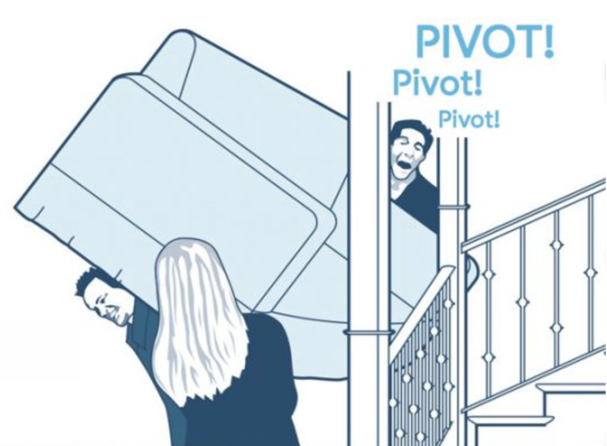

This is my initial post sharing my journey in web development so far — a journey that commenced during my college days and ultimately steered me towards becomimng a passionate Drupal enthusiast.

### Discovering Drupal: A Shift from Joomla

My path to the world of content management systems began back in college. At the time, Joomla was the default choice for constructing the university's community website, and it was already outdated. I was tasked with modernizing the old site, making it responsive, and aiding the content team in generating news, articles, and pages. Naturally, my curiosity led me to explore Drupal.

Taking the bold step of transitioning from Joomla to Drupal 7 marked a significant turning point in my career (which I did not know). The challenge wasn't just adapting to a new system but also tailoring it to meet the university's needs. Facing a shortage of contributed modules in real estate, I also developed a custom module to enable students to post listings, adding a layer of functionality that resonated with the community.

### Pivot! Pivot! Pivot!

After my college years I spent a solid two to three years working with a custom-made CMS and some smaller sites. Although it wasn't Drupal, this phase in my professional journey allowed me to focus on content management systems, deepening my understanding of their fundamentals and how they are designed. This was a fun and awesome transitional period which broadened my technical skills and laid the foundations for what lay ahead.

### Falling in love with Drupal

As I delved deeper into Drupal post-college, I was fortunate to cross paths with an exceptional mentor at Cheppers. He played a crucial role in shaping my understanding of Drupal and its standards. Learning from someone who had navigated the Drupal ecosystem for years provided me with invaluable insights. The intense two-month learning journey, coupled with subsequent collaborative projects aided by experienced Drupal engineers, solidified my passion. This is the part where my continuous pursuit of understanding Drupal at its core becme an ongoing eneavor.

### Back To The (Future) Community

Fast forward to last year, and I find myself at the forefront of Drupal's evolution—working on top contributed modules to ensure they are Drupal 10 ready before Drupal 10 is released. My journey with Acquia has been an exciting ride, allowing me to contribute meaningfully to the Drupal community. Collaborating with a team of talented developers, our focus was to push the limits and make every major contributed module compatible with the latest release of Drupal.

Knowing that the modules we made compatible are part of the foundation of websites and applications across the globe has been a fulfilling experience. 

> This was a great experience, and a chance to learn from some of the best people I know. I'm sure we'll meet again for another round in the near future!

### Feelings

The collaborative spirit of the Drupal community, marked by a willingness to help, continues to inspire me and I want to thank to my mentors and the senior developers whose guidance and expertise have been the driving force behind my passion for Drupal. Their insights and support have enriched my technical skills and shaped my understanding of best practices and community values. This collective influence has been instrumental and I'm proud to contribute to the Drupal community. 
