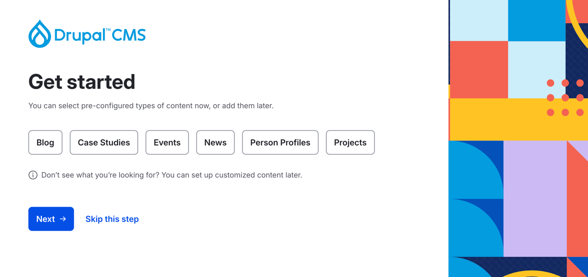

Drupal is changing, and it feels like a return to what made it exciting in the first place. With tools like the Drupal CMS Launcher, Experience Builder, Site Templates and a potential Marketplace, there’s a clear focus on simplifying the process for newcomers, without the unnecessary barriers. These features have the potential to reshape how sites are built, especially for those just getting started, while still preserving the power and flexibility that make Drupal stand out.

### Back to The Future

When I first stumbled into the world of Drupal, I didn’t know the journey I was beginning. I wasn’t a full-fledged developer. I was just someone curious — someone who wanted to build something on the web without writing thousands of lines of code. Drupal was this powerful, almost mysterious ecosystem of modules, blocks, and possibilities. I started experimenting — adding contrib modules, tinkering with views, rearranging fields within content types, and seeing a real site take shape before my eyes. No heavy custom code, just configuration and exploration.

**That hands-on, modular approach is what made me fall in love with Drupal.** It empowered me. It turned curiosity into confidence, and confidence into a career. I was lucky to have an awesome mentor who helped me understand the basics and encouraged me to keep going. From there, I received so much support from fellow developers — some of whom I still work with to this day. Their insight, patience, and passion not only helped me grow but continue to motivate me every day to push further and do more.

That’s why these new features matter. Without that initial spark — without the chance to fall in love with Drupal through building, exploring, and seeing things come to life — **many won’t make it far enough to discover the deeper, more powerful side of what Drupal can do.** And when that happens, we risk losing people who might have brought fresh ideas, perspectives, and energy into the community.

> A brighter future begins with an easier start.

### What’s Making It Easier

[Drupal CMS Launcher](https://new.drupal.org/drupal-cms/launcher) is one of the most impactful additions in recent years in my opinion. I’ve mentioned in previous blog posts that Drupal’s barrier to entry has traditionally been too high, especially for those without a development background. This tool directly addresses that issue. It allows anyone — regardless of technical experience — to spin up a Drupal site locally in seconds. No Composer commands, no Docker setup, no complex environment configuration. Just Drupal, ready to explore.

**Experience Builder** represents a major leap forward in how Drupal approaches layout and content creation. It introduces a visual, drag-and-drop interface that lets users build and customize pages directly in the browser — without touching code or diving into complex configuration. This helps non-developers and site builders to create meaningful, responsive layouts while staying true to Drupal’s structured content model. It’s especially powerful for prototyping and enabling content teams to work more independently. 

**Site Templates** are designed to solve one of Drupal’s long-standing challenges: the time and complexity involved in building a site from scratch. These templates offer pre-configured starting points that combine [Recipes](/drupal-recipes/), themes, and default content to deliver a working baseline out of the box. Whether you're building a blog, portfolio, or nonprofit site, Site Templates help reduce setup time.

And then there's the **Marketplace**, which is currently under exploration. The idea is to provide a curated space for discovering high-quality site templates — both open source and commercial — to help users kickstart their projects. It has the potential to be an incredible resource, especially for new users looking to build quickly without sacrificing quality. However, it comes with a nuance: if monetization takes over, there’s a risk of fragmenting the ecosystem or pushing people toward paywalled solutions. 

There’s a blog post that outlines the pros and cons of a paid Marketplace on Dries’ blog, and while it’s not my intention to dive into that discussion here, it’s important to acknowledge that this shift is possible — and that we must find the balance.

While each of these features deserves a closer look — and perhaps they will get one in time — this overview is only meant to show how they collectively contribute to a better experience for everyone.

### Thoughts

A new era is coming for Drupal, and it’s not just about simplifying the platform. It’s about making the first impression more welcoming, more intuitive, and more forgiving. And that matters — because the **first few hours someone spends with Drupal often determine whether they stick around or walk away.**

I’ve written before about how [documentation could be improved](/simplifying-drupal-documentation/) — and that’s still something we can continue to improve alongside these new tools. But this direction is a huge step forward. Giving people the ability to launch, build, and explore without needing to untangle the backend first is how we keep the door open. It's how we show that Drupal isn't just for enterprise teams and experienced developers — it’s also for the curious, the creative, and the ones who just want to see what’s possible.

Of course, none of these tools appeared out of nowhere. They’re the result of countless hours of thought, experimentation, and collaboration from people across the Drupal community. These changes aren't just for new Drupalists — they’re opportunities for all of us to rethink how we build, collaborate, and teach. As developers, we have a role to play in embracing these features, contributing feedback, and helping shape the future we want to be part of.

By leaning into these changes and supporting a smoother onboarding experience, we’re not lowering standards. **This isn’t about dumbing Drupal down. It’s about making sure more people get the chance to fall in love with it** — just like I did.

