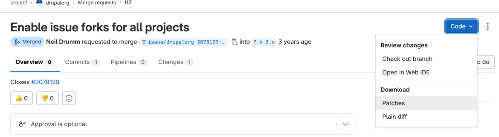

There is an ongoing debate among developers regarding the use of patches versus pull requests for contributions. Since its migration to GitLab in 2018, Drupal has undergone significant changes. As of July 2024, the removal of Drupal CI and automated patch testing could potentially change the way contributions are made.

> [TL;DR; - Jump to the 'Patches vs. Pull Requests' section](#patches-vs-pull-requests)

### Transitioning of testing platforms

#### Understanding the change

In July 2023, Gitlab CI was enabled for all contrib projects on Drupal.org, allowing users to use both Drupal CI and the new platform. The recommendation was to disable the old configurations to free up resources, and a guide on [how to get started with GitLab CI](https://www.drupal.org/docs/develop/git/using-gitlab-to-contribute-to-drupal/gitlab-ci) was also posted to help project maintainers. 

Drupal announced in October 2023 that [testing core is five times faster](https://www.drupal.org/about/core/blog/drupal-cores-gitlab-ci-testing-is-now-five-times-faster-than-drupalci) on the new platform than it was before. Also, a series of adjustments and refactors occurred, contributing to the overall optimization of the testing process resulting in the __Drupal core on-commit and regression testing movement to GitLab CI.__ This move not only showcased the capabilities of the new platform, but also affirmed its viability.

As a result, projects will no longer have the option to add Drupal CI configurations if they haven't already been configured prior to February 2024, and direct access to log outputs and artifacts will no longer be available.

These developments mark a decisive step towards the ultimate decision slated for __July 2024: the discontinuation of Drupal CI test runs__, which leads to the point of this post: to patch or not to patch.

#### What happens with patches?

While patches will continue to be available in the issue queues, the absence of test runs and testing results (from 2025) raises concerns about reliability and compatibility.

This means __the currently configured patches served from the issue queues will still work__, but for new patches (and possibly even existing ones) Drupal engineers must exercise caution and manual testing in the future — or other quality assurance measures — to mitigate potential hazards as GitLab CI cannot test patch files.

### Patches vs. Pull Requests?

To be honest, each approach comes with its own set of advantages and challenges, and both are commonly used in the open-source community.

The primary method for contributing to Drupal projects was by submitting patches for over 20 years. One significant advantage of this approach is the static nature of the patch file, allowing direct referencing in a site's `composer.json`. As projects are updated to newer versions, the community typically re-rolls the patch until the issue is ultimately resolved, ensuring users have access to updated versions that can be seamlessly integrated into their site. _(A common scenario here is when a project is updated in composer.json, and the patch applied previously becomes incompatible with the new version.)_

The Pull Request approach and GitLab does not have this functionality __yet__. Currently, it's possible to obtain a diff or patch file for an entire pull request changeset from GitLab by appending the `.diff` or `.patch` extension. However, this method is not immune to changes over time. This means, if a site uses continuous deployment where composer install is regularly executed (and the Pull Request on GitLab is updated with changes), unexpected issues could arise, not to mention that it is a __security risk__.

While it's possible to mitigate this risk by downloading the changeset provided by GitLab at the specific time when the change is needed, it raises the question: how does this differ from utilizing the patch files?

* The first part of the answer probably lies in the enhanced visibility of changes within a pull request compared to navigating through patches (and interdiffs). Pull requests offer a more streamlined and productive means of collaboration, particularly when engaging with multiple contributors. 

* The second part is __since patches won't get test runs anymore__ (or at least not with Drupal CI)__, project maintainers may favor pull requests over patches when evaluating contributions in the future__, and Drupal.org plans to [migrate the current issues to GitLab issues](https://www.drupal.org/project/drupalorg/issues/3295357) which has the potential to eliminate the need for patch files in the long run.

> Side note: To address this, GitLab needs to merge the [related pull request](https://gitlab.com/gitlab-org/gitlab/-/issues/217206) that could resolve the problem of ever-changing diffs.

##### How to apply pull requests to a site?

The statement above does not necessarily imply that you should start adding pull requests to your site immediately. On the contrary, __you should never reference a pull request patch file__ (until GitLab resolves the issue by allowing `.patch` to be appended to any compare URL) __as its content can change as commits are pushed__.

If a project's issue doesn't require patches and solely relies on merging and testing on GitLab, you could append the `.patch` extension to the pull request, then __download the file and use it in Composer from a local directory__, or just use the UI to download the diff.

### The Answer

Based on the above, the approach moving forward would involve using pull requests on GitLab for enhanced visibility and testing changes. Additionally, we will utilize patches based on the pull request changes, effectively employing both concurrently.

### Thoughts

I look forward to the day when GitLab's capabilities for patches between any two references become accessible, and the need for downloading and storing local copies of patch files becomes unnecessary. Also, I want to urge contributors to familiarize themselves with GitLab ahead of the migration of the Drupal.org issue queue, as pull requests are inevitable.
